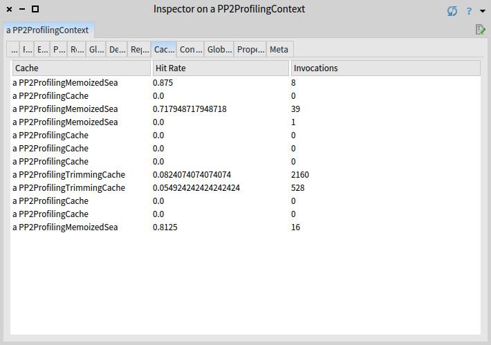

# Caches

In the [Optimizations](optimizations.md) chapter we have briefly described optimizations based on specializations and caching.
In this text we describe the caches used by PetitParser2.

PetitParser2 utilizes four different caches that can be split into two categories:

1. First category contains fast and memory efficient caches, which remember only the last result of an underlying parser. If it happens that a parser is invoked at the same position again, the result is returned without any parsing. If the position differs, the underlying parser is invoked and the result is remembered for the new position. --The fast caches cannot be applied for the context-sensitive parsers, i.e. for parsers whose result depends on some other parameters than a position, e.g. the parser generated from the ```elClose``` rule.--


1. The second category contains slower and more memory intense caches that remember every result for the given position. We call these caches memoizing caches. If it happens a parser is invoked at any position it has been invoked before, the result is returned without any parsing. --Furthermore, if a parser is context-sensitive, the cache uses the whole context as a key.--


You can inspect the performance of caches in the cache view:

@@todo create a screenshot with the memoization cache and fix the paragraph.



There are three caches visble in the cache view: (i) cache and (ii) trimming cache belong to the first category and (iii) sea memoization cache belongs to the second category. 
We discuss these caches briefly in the following text.

## Cache
Cache improves performance of choice that has alternatives with the same prefix. 
Consider ```unary``` (e.g. ''parser'') and ```keyword``` (e.g ''parser:'') in Smalltalk:
```smalltalk
(identifier, $: asPParser not) / 
(identifier, $: asPParser)
```

Normally, if the ```identifier``` is not followed by ```:```, the parser backtracks and parses identifier again. 
Optimizations of PetitParser2 can detect such a case and protect ```identifier``` with a cache, preventing superfluous invocation of ```identifier```.


## Trimming Cache
The trimming cache improves the performance of grammars using trimmed tokens, e.g.:

```smalltalk
keyword token trim, identifier token trim
```

Because each token trims whitespaces before and after itself, the trimming in between tokens happens twice. 
The trimming cache prevents this. 
Because trimming whitespace is usually rather fast operation, the trimming cache has impact only for very fast almost deterministic and context-free grammars such as *Smalltalk grammar>smalltalkOptimizations.pillar*.


## Memoization Cache


## Sea Memoization Cache
The sea memoization cache is tailored to bounded seas. 
Due to the nature of bounded seas, in some cases parsing a grammar with bounded seas can result in an exponential time complexity, performing lots of redundant work. 
Because the traditional cache would not be able to reduce the exponential overhead (it can only reduce the overhead by a constant), the seas are memoized.
Memoization requires more memory, but it gives bounded seas the good old linear complexity.


